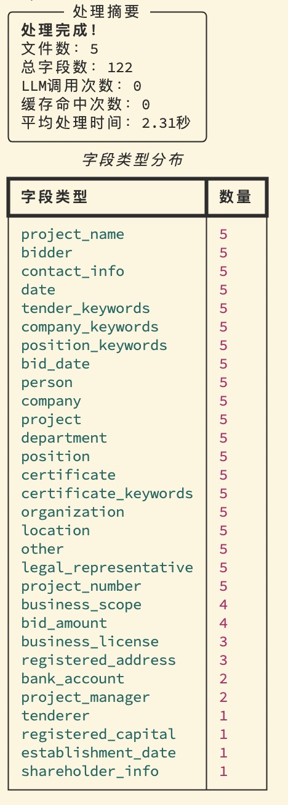

# 标书信息提取工具

[English](README_EN.md) | 中文

## 📖 项目介绍

### 项目背景

在招投标行业中，标书文档通常包含数百页甚至上千页的复杂信息。传统人工提取方式存在效率低下、成本高昂、准确性不足等问题。

### 项目目的

`tender-extract` 通过**混合抽取技术**（规则引擎 + 大语言模型）实现智能化标书信息提取：

- **自动化提取**：从大量文档中自动识别关键字段
- **成本优化**：规则层覆盖60-90%字段，大幅降低大语言模型调用成本
- **高精度保证**：结合确定性规则和智能推理
- **可审计追溯**：保留原文证据，支持结果验证
- **标准化输出**：统一结构化数据格式

> 面向**千页**级别中文标书的**混合抽取**流水线：先用**规则/词典/命名实体识别**处理确定性字段，仅将**低置信/冲突**片段路由给**大语言模型**，在保证可审计的同时显著降本增效。

## 🚀 核心优势

- **高效处理**：5个文档仅需2.31秒，平均每个文档0.46秒
- **成本控制**：规则层覆盖60-90%硬字段，大语言模型调用次数大幅降低
- **可审计性**：每个抽取结果都保留原文证据片段
- **详细监控**：实时显示处理进度，便于调试

## ✨ 功能特性

- **Markdown结构解析**：基于章节树构建，递归字符切分
- **高吞吐规则层**：正则表达式+关键词启发式，一次抽取金额/日期/联系方式等
- **极速词典匹配**：Aho–Corasick算法批量短语扫描
- **智能去重**：RapidFuzz+MinHash局部敏感哈希，避免重复处理
- **按需大语言模型**：仅低置信时路由最小证据片段，支持OpenAI/Ollama
- **结构化输出**：Pydantic数据校验，保留证据片段便于审计

## 📊 性能表现



**抽取统计**：
- 26种字段类型，平均每文档24.4个字段
- 高频：项目名称、投标人、联系方式、日期
- 中频：经营范围、投标金额、营业执照
- 低频：注册资本、股东信息、项目经理

---

## 🛠️ 快速开始

### 安装

```bash
# 克隆并安装
git clone <repository-url>
cd tender-extract
uv sync --extra cli

# 可选：安装命名实体识别支持
uv sync --extra ner

# 验证安装
uv run tender-extract --help
```

### 基础用法

```bash
# 仅规则抽取（最快）
uv run tender-extract extract ./examples/ --out ./out --llm none

# 启用大语言模型（需要API密钥）
export OPENAI_API_KEY=your-api-key
uv run tender-extract extract ./examples/ --out ./out --llm openai --model gpt-4o-mini

# 本地Ollama
uv run tender-extract extract ./examples/ --out ./out --llm ollama --model deepseek-r1:32b
```

### 主要参数

- `input_path`：输入文件或目录
- `--out`：输出目录（默认./out）
- `--llm`：none | ollama | openai
- `--use-ner`：启用中文命名实体识别
- `--verbose`：显示详细进度
- `--debug`：大语言模型调试模式

---

## 📂 项目结构

```
tender-extract/
├── config/example.yaml           # 规则配置
├── data/dicts/keywords_zh.txt    # 关键词词典
├── examples/                     # 示例文档
└── src/tender_extract/
    ├── cli.py                    # 命令行接口入口
    ├── preprocess.py             # Markdown预处理
    ├── rules.py                  # 规则抽取
    ├── llm_router.py             # 大语言模型路由
    └── schema.py                 # 输出模型
```

---

## ⚙️ 配置

### 规则配置

编辑 `config/example.yaml`：

```yaml
patterns:
  date:
    - pattern: r'(\d{4}年\d{1,2}月\d{1,2}日)'
      confidence: 0.9
  amount:
    - pattern: r'人民币[壹贰叁肆伍陆柒捌玖拾佰仟万亿]+元'
      confidence: 0.8

synonyms:
  - [评标办法, 资格条件, 联合体]
  - [法定代表人, 法人代表, 负责人]
```

---

## 🔍 工作原理

1. **预处理**：解析Markdown章节树，递归字符切分
2. **规则抽取**：正则表达式+关键词提取硬字段
3. **去重识别**：MinHash局部敏感哈希避免重复处理
4. **大语言模型路由**：仅低置信片段送入大语言模型

---

## 📊 输出格式

```json
{
  "metadata": {
    "filename": "example.md",
    "processing_time": 2.31,
    "total_fields": 24
  },
  "fields": {
    "project_name": {
      "primary_value": "测试工程项目",
      "confidence": 0.95,
      "values": [{
        "value": "测试工程项目",
        "source": "rules",
        "start": 100,
        "end": 110
      }]
    }
  }
}
```

---

## 🎯 适用场景

- **招标代理**：批量处理投标文件
- **评标专家**：快速获取标书核心信息
- **监管部门**：自动化合规审核
- **研究机构**：标书数据分析
- **企业投标**：竞争对手分析

---

## 🐛 故障排除

### 常见问题

```bash
# 安装失败
python --version  # 确保3.12+
uv sync --reinstall

# Ollama连接失败
curl http://your-ollama-server:11434/api/tags
export OLLAMA_BASE_URL=http://your-ollama-server:11434

# 调试技巧
uv run tender-extract extract ./examples/ --out ./out --verbose --debug
```

---

## 📝 许可证

MIT许可证 - 详见 [LICENSE](LICENSE) 文件。


