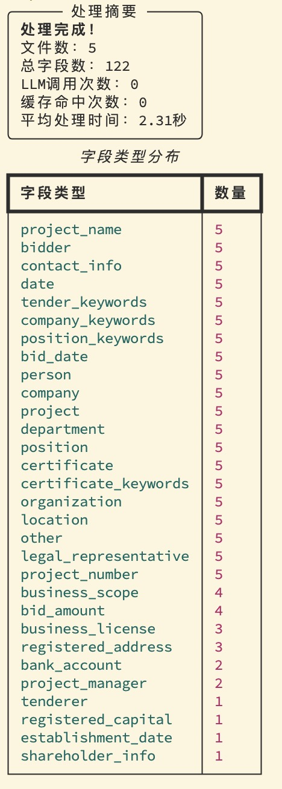

# tender-extract

English | [中文](README.md)

## 📖 Introduction

### Project Background

In the bidding and tendering industry, tender documents typically contain hundreds or even thousands of pages of complex information. Traditional manual extraction methods face issues of low efficiency, high costs, and insufficient accuracy.

### Project Objectives

`tender-extract` achieves intelligent tender document information extraction through **hybrid extraction technology** (rule engine + large language models):

- **Automated Extraction**: Automatically identify key fields from large volumes of documents
- **Cost Optimization**: Rule layer covers 60-90% of fields, dramatically reducing LLM API call costs
- **High Precision**: Combine deterministic rules with intelligent reasoning
- **Auditable Traceability**: Preserve original text evidence for result verification
- **Standardized Output**: Unified structured data format

> A **hybrid extraction** pipeline for **thousand-page** level Chinese tender documents: First use **rules/dictionaries/NER** to process deterministic fields, then route only **low-confidence/conflicting** fragments to **LLM**, ensuring auditability while significantly reducing costs and improving efficiency.

## 🚀 Core Advantages

- **High Performance**: 5 documents processed in only 2.31 seconds, averaging 0.46 seconds per document
- **Cost Control**: Rule layer covers 60-90% of hard fields, dramatically reducing LLM API calls
- **Auditability**: Each extraction result preserves original text evidence fragments
- **Detailed Monitoring**: Real-time display of processing progress for debugging

## ✨ Features

- **Multi-format Parsing**: PDF / DOCX / TXT / Markdown
- **Module Routing**: Route chapter chunks to 9 specialist modules
- **High-Throughput Rule Layer**: Regex + keyword heuristics, one-pass extraction of amounts/dates/contact info
- **Ultra-Fast Dictionary Matching**: Aho–Corasick batch phrase scanning
- **Intelligent Deduplication**: RapidFuzz + MinHash LSH to avoid duplicate processing
- **On-Demand LLM**: Route minimal evidence fragments only when low confidence; OpenAI, Azure, Anthropic, Gemini, Ollama, DeepSeek, Qwen, and other OpenAI-compatible providers
- **Structured Output**: Pydantic validation with evidence_spans for auditing

## 📊 Performance



**Extraction Statistics**:
- 26 field types, average 24.4 fields per document
- High-frequency: project name, bidder, contact info, dates
- Medium-frequency: business scope, bid amount, business license
- Low-frequency: registered capital, shareholder info, project manager

### Sample documents

| File | Description |
|------|-------------|
| `examples/example.md` | Synthetic tender covering project name, bidder, amounts, deposit, personnel |
| `examples/example.pdf` | Real public procurement PDF (Hefei Xue-liang project, 10 pages) |

```bash
uv run tender-extract extract ./examples/example.pdf --out ./out
uv run tender-extract extract ./examples/example.md --out ./out
```

---

## 🛠️ Quick Start

### Installation

```bash
# Clone and install
git clone <repository-url>
cd tender-extract
uv sync --extra all

# Optional extras
uv sync --extra pdf    # PyMuPDF
uv sync --extra docx   # python-docx
uv sync --extra ocr    # PaddleOCR

# Verify installation
uv run tender-extract --help
```

### Basic Usage

```bash
# Rule-based extraction only (fastest)
uv run tender-extract extract ./examples/ --out ./out --llm none

# Enable LLM (requires API key)
export OPENAI_API_KEY=your-api-key
uv run tender-extract extract ./examples/ --out ./out --llm openai --model gpt-4o-mini

# Local Ollama
uv run tender-extract extract ./examples/ --out ./out --llm ollama --model deepseek-r1:32b

# List providers
uv run tender-extract providers
```

`extract-v2` remains as an alias of `extract`.

### Main Parameters

- `input_path`: Input file or directory
- `--out`: Output directory (default ./out)
- `--llm`: `none` or a provider id (`openai` / `ollama` / `anthropic` / `deepseek` / …)
- `--model`: Model name (Azure: deployment name)
- `--use-ner`: Enable Chinese NER
- `--include-pii`: Write full ID numbers (masked by default)
- `--verbose`: Show detailed progress
- `--debug`: LLM debug mode

---

## 📂 Project Structure

```
tender-extract/
├── config/example.yaml           # Rule configuration
├── data/dicts/keywords_zh.txt    # Keyword dictionary
├── examples/
│   ├── example.md                # Markdown sample
│   └── example.pdf               # Real tender PDF
└── src/tender_extract/
    ├── cli.py                    # CLI entry
    ├── pipeline.py               # Unified extraction pipeline
    ├── preprocess.py             # Markdown preprocessing
    ├── rules.py                  # Rule extraction
    ├── llm_router.py             # LLM routing
    └── schema.py                 # Output model
```

---

## ⚙️ Configuration

### Rule Configuration

Edit `config/example.yaml`:

```yaml
patterns:
  date:
    - pattern: r'(\d{4}年\d{1,2}月\d{1,2}日)'
      confidence: 0.9
  amount:
    - pattern: r'人民币[壹贰叁肆伍陆柒捌玖拾佰仟万亿]+元'
      confidence: 0.8

synonyms:
  - [评标办法, 资格条件, 联合体]
  - [法定代表人, 法人代表, 负责人]
```

---

## 🔍 How It Works

1. **Parse**: Convert PDF/DOCX/TXT to Markdown
2. **Chunk**: Recursive character splitting, chapter-aware
3. **Route**: Keyword routing into specialist modules
4. **Extract**: Regex + optional NER; LLM only for low-confidence spans
5. **Merge**: Dedup, conflict resolution, cross-field checks

---

## 📊 Output Format

```json
{
  "metadata": {
    "filename": "example.md",
    "processing_time": 2.31,
    "total_fields": 24
  },
  "fields": {
    "project_name": {
      "primary_value": "Test Engineering Project",
      "confidence": 0.95,
      "values": [{
        "value": "Test Engineering Project",
        "source": "rules",
        "start": 100,
        "end": 110
      }]
    }
  }
}
```

---

## 🎯 Use Cases

- **Bidding Agencies**: Batch process tender documents
- **Evaluation Experts**: Quickly obtain core tender information
- **Regulatory Bodies**: Automate compliance review
- **Research Institutions**: Tender data analysis
- **Enterprise Bidding**: Competitor analysis

---

## 🐛 Troubleshooting

### Common Issues

```bash
# Installation failure
python --version  # Ensure 3.12+
uv sync --reinstall

# Ollama connection failure
curl http://your-ollama-server:11434/api/tags
export OLLAMA_BASE_URL=http://your-ollama-server:11434

# Debugging tips
uv run tender-extract extract ./examples/ --out ./out --verbose --debug
```

---

## 📝 License

MIT License - See [LICENSE](LICENSE) file for details.
