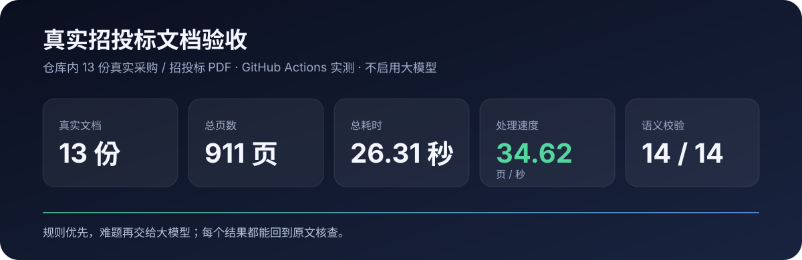

# tender-extract · Structured extraction for Chinese tender documents

English | [中文](README.md)

> **Turn large procurement and tender documents into structured, auditable data.**
> Deterministic rules handle the fast path; LLMs are only used for uncertain fields. Results retain source text, page numbers and PDF coordinates when available.



## Why use it

- ⚡ **Fast** — one committed acceptance corpus of **13 real documents / 911 pages** runs in **26.31 s, 34.62 pages/s** without LLM calls.
- 🔎 **Auditable** — extracted values can carry file, page, source text and PDF bounding boxes.
- 🧠 **LLM on demand** — low-confidence, conflicting or missing fields can be routed to an LLM instead of sending the whole PDF to a model.
- 📦 **Project-aware** — tender, amendment, clarification and multiple bidder files can be handled as one package while preserving revisions and bidder isolation.
- ✅ **Measurable quality** — human review can flow back into Gold Datasets and CI Precision / Recall / F1 gates.

## Easiest start: run the HTTP server

```bash
docker pull ghcr.io/inupedia/tender-extract-server:0.1.0

docker run --rm \
  -p 8000:8000 \
  -v tender-extract-cache:/data/cache \
  ghcr.io/inupedia/tender-extract-server:0.1.0
```

Upload a PDF:

```bash
curl -s \
  -F "file=@example.pdf" \
  "http://localhost:8000/v1/extract?llm_provider=none"
```

OpenAPI docs are available at `http://localhost:8000/docs`.

```text
GET  /healthz      health check
GET  /v1/info      version and capabilities
POST /v1/extract   PDF / DOCX / Markdown / TXT extraction
```

Optional API-key protection:

```bash
docker run --rm -p 8000:8000 \
  -e TENDER_SERVER_API_KEY=your-secret \
  ghcr.io/inupedia/tender-extract-server:0.1.0
```

Then send the key in the `X-API-Key` header.

To enable SiliconFlow inside the container:

```bash
docker run --rm -p 8000:8000 \
  -e SILICONFLOW_API_KEY=your-key \
  -e TENDER_SERVER_LLM_PROVIDER=siliconflow \
  -e TENDER_SERVER_LLM_MODEL=Qwen/Qwen3-8B \
  -v tender-extract-cache:/data/cache \
  ghcr.io/inupedia/tender-extract-server:0.1.0
```

Images are released only from server version tags. For example, Git tag `server-v0.1.0` publishes image tag `:0.1.0` and updates `:latest`; ordinary pushes to `main` do not publish a server image.

## Local CLI

Requires Python **3.12+**.

```bash
git clone https://github.com/Inupedia/tender-extract.git
cd tender-extract

uv sync --extra pdf
uv run tender-extract extract examples/example.pdf --out out
```

Batch extraction:

```bash
uv run tender-extract extract ./documents --pattern "*.pdf" --out out
```

## What the output looks like

The committed 10-page `examples/example.pdf` currently extracts fields such as:

```text
project_name    合肥市公安局瑶海分局雪亮工程支网一期、二期、三期运维服务采购项目
project_number  2024BFFFZ01583
tenderer        合肥市公安局瑶海分局
bid_amount      437.677万元
bid_date        2024年7月1日17时30分
contact_info    055166223642
```

A value is not just a string. It can retain source provenance:

```json
{
  "project_name": {
    "primary_value": "合肥市公安局瑶海分局雪亮工程支网一期、二期、三期运维服务采购项目",
    "confidence": 0.99,
    "values": [
      {
        "location": {
          "document_id": "example.pdf",
          "page": 1,
          "source_text": "合肥市公安局瑶海分局雪亮工程支网一期、二期、三期运维服务采购项目"
        }
      }
    ]
  }
}
```

For reliably locatable PDF text, evidence can also include the real page bounding box.

## Real-document acceptance

`examples/` is one reproducible acceptance corpus covering Anhui, Beijing, Shaanxi, Henan and Shanghai: **13 real procurement/tender PDFs, 911 pages total**.

| Metric | Result |
|---|---:|
| Documents | **13** |
| Pages | **911** |
| Wall time | **26.31 s** |
| Throughput | **34.62 pages/s** |
| Semantic checks | **14 / 14 passed** |
| Failures | **0** |

The benchmark is measured in GitHub Actions with LLM disabled. OCR, hardware, storage and document layout can change throughput.

Source URLs, page counts and SHA256 values are recorded in [`examples/public-corpus.lock.json`](examples/public-corpus.lock.json). Normal CI runs entirely against the committed files.

```bash
uv run python scripts/acceptance_corpus.py \
  --examples examples \
  --min-pdfs 13 \
  --report artifacts/real-pdf-acceptance.json
```

## Hybrid extraction instead of whole-document LLM calls

```text
PDF / DOCX / Markdown / TXT
            │
            ▼
       parse + chunk
            │
            ▼
    rules / structure
       │         │
       │         └── low confidence / conflict / missing
       │                              │
       │                              ▼
       │                         LLM review
       │                              │
       └──────────────┬───────────────┘
                      ▼
             merge + evidence
                      │
                      ▼
                structured JSON
```

SiliconFlow `Qwen/Qwen3-8B` has been live-tested: **4/4 network calls succeeded** in the cold run; the second run reused **4 cache entries with 0 new network calls**. The current live Gold evaluation reached **Micro F1 1.000 / Macro F1 1.000** on its acceptance case.

```bash
export SILICONFLOW_API_KEY=your-key
uv run tender-extract extract examples/example.pdf \
  --llm siliconflow \
  --model Qwen/Qwen3-8B \
  --out out
```

The provider registry also includes OpenAI, DeepSeek, Qwen/DashScope, Claude, Gemini, Ollama and generic OpenAI-compatible endpoints.

## Multi-file tender packages

```text
project/
├── tender.pdf
├── amendment-01.pdf
├── clarification-01.pdf
├── bidder-a.pdf
└── bidder-b.pdf
```

```bash
uv run tender-package validate package.yaml
uv run tender-package extract package.yaml --out out/package.json
```

Amendments can supersede older values while historical evidence remains available, and bidder A cannot overwrite bidder B.

See [`docs/tender-package.md`](docs/tender-package.md).

## Human review and evaluation

```bash
uv run tender-review run examples/example.pdf --queue .review/queue.jsonl
uv run tender-review export --queue .review/queue.jsonl --out eval/gold-reviewed.jsonl
uv run tender-extract eval eval/gold-reviewed.jsonl
```

CI can enforce an F1 floor:

```bash
uv run tender-extract eval eval/gold.jsonl --fail-under 0.95
```

See [`docs/human-review.md`](docs/human-review.md), [`docs/evaluation.md`](docs/evaluation.md), and [`docs/evidence.md`](docs/evidence.md).

## Capabilities

| Capability | Support |
|---|---|
| Usage | Python CLI, HTTP API, Docker / GHCR image |
| Formats | PDF, DOCX, Markdown, TXT |
| Scanned files | Optional OCR; the lean server image does not bundle PaddleOCR |
| Extraction | Rules, dictionaries, NER, optional LLM review |
| Evidence | File, page, section, line, source text, PDF bbox |
| Project handling | Multi-file revisions, amendments/clarifications, bidder isolation |
| Human review | Accept, correct, reject, export Gold Dataset |
| Evaluation | Precision, Recall, F1, CI quality gates |
| Privacy | PII masked by default; optional server API key |

## License

MIT
